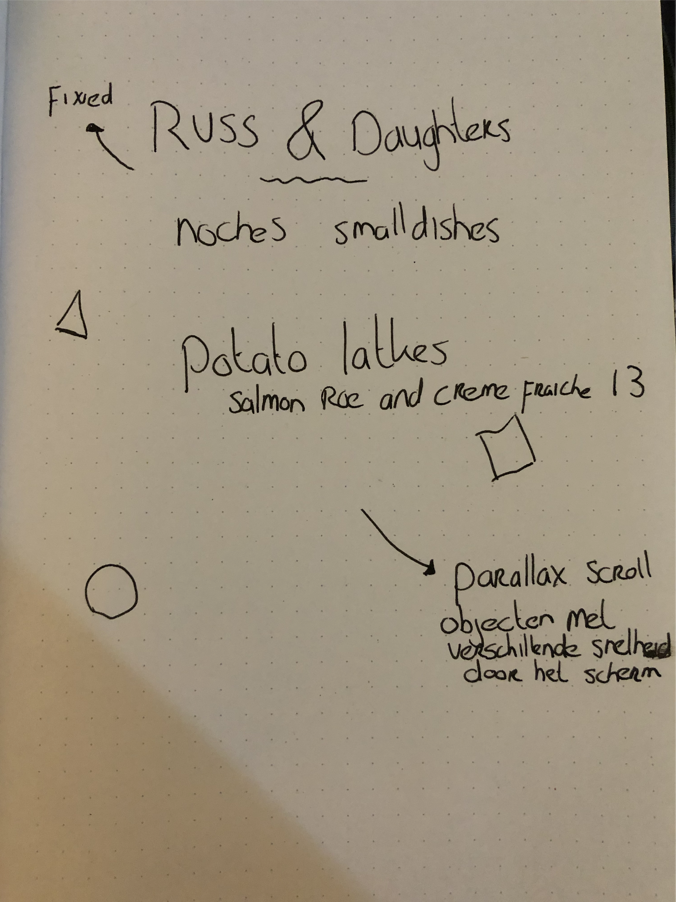
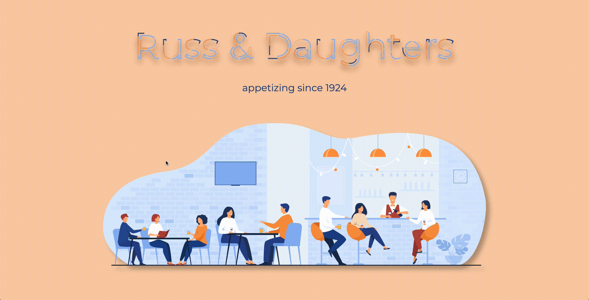

# CSS to the Rescue
Gebruik de liveversie om de effecten het best te zien!
https://jimmydekroon.github.io/css-to-the-rescue-2021/docs/assignments/menu.html

# Context
- Prefers-color-scheme: De app zal in dark mode of light mode te zien zijn aan de hand van de color scheme in de OS.

# Parallax scroll
Voor deze opdracht wil ik een parallax scroll gebruiken om wat beweging en diepte toe te voegen aan het menu.
Het idee is om de menuitems sneller te laten scrollen dan de achtergrond en ook een aantal svg items met andere snelheden te laten scrollen. de svg's worden de ingredienten van het gerecht.

# Week 1
In de eerste week ben ik vooral bezig geweest met zoeken naar interessante css technieken en het vastleggen van de context en eisen. Ik heb ook een snelle schets gemaakt. 


Verder is er een klein beetje css geschreven om dingen te positioneren en voor wat kleur.

# Week 2 
Meer opmaak gedaan voor het menu en de gerechten. Het parallax effect werkende krijgen was niet makkelijk maar werkt voor de gerechten. De svg's (ingredienten) moeten nog worden gedaan. Hieronder kan je zien hoe de parallax er nu uitziet:


# Week 3
Parallax effect wat getweaked en toegevoegd op de svg's (ingredienten). Verder heb ik geprobeerd wat leuks te doen met de titel en heb ik de eerste stappen voor de prefers-color-scheme gemaakt.

Hier het resultaat van de titel


Hier het resultaat van de scroll en een nieuwe animatie voor de subtitels (WIP)


# Main features & code
## De titel animatie
De titel wilde ik graag animeren en ik heb gekozen voor een stroke animatie. Met 1 stroke per letter zag de animatie er raar uit dus heb ik ervoor gekozen om de stroke op te delen in 5 stukken.


### De code
HTML:
```html
<svg viewBox="">
	<symbol id="rest-title">
		<text text-anchor="middle" x="50%" y="70%">Russ & Daughters</text>
	</symbol>
			
	<g class = "title-copies">
		<use xlink:href="#rest-title" class="text-copy"></use>
		<use xlink:href="#rest-title" class="text-copy"></use>
		<use xlink:href="#rest-title" class="text-copy"></use>
		<use xlink:href="#rest-title" class="text-copy"></use>
		<use xlink:href="#rest-title" class="text-copy"></use>
	</g>
</svg>
```

Ik maak een svg aan zodat ik de stroke kan animeren. Met de use tag maak ik meerdere kopieen van de titel, deze ga ik later met een delay achter elkaar aan animeren.

CSS:
```css
.text-copy {
  fill: none;
  stroke: #fff;
  stroke-dasharray: 6% 29%;
  stroke-width: 5px;
  stroke-dashoffset: 0%;
  animation: stroke-offset 5.5s infinite linear;
}

.text-copy:nth-child(1){
	stroke: var(--accent);
	animation-delay: -1;
}

.text-copy:nth-child(2){
	stroke: var(--secondary);
	animation-delay: -2s;
}

.text-copy:nth-child(3){
	stroke: var(--accentalt);
	animation-delay: -3s;
}

.text-copy:nth-child(4){
	stroke: var(--accentalt);
	animation-delay: -4s;
}

.text-copy:nth-child(5){
	stroke: var(--colorstrong);
	animation-delay: -5s;
}

@keyframes stroke-offset{
	100% {stroke-dashoffset: -35%;}
}
```

De copy's worden aangeroepen door de :nth-child() en ze hebben allemaal een eigen kleur en animatie delay. de min zorgt ervoor dat de animatie al onderweg is. 

## subtitel animatie
Voor de subtitle heb ik een andere animatie geprobeerd. Door gebruik te maken van de ::before en ::after heb ik een border gemaakt die half voor en half achter de subtitel zit.


### de code
```CSS
section header::before, section header::after {
  content: '';
  padding: 3.5em 2em;
  position: absolute;
  left: 50%;
  width: 100%;
  top: 50%;
  display: block;
  border: 15px solid var(--secondary);
  animation: 10s infinite alternate ease-in-out headerrotate;
}

section header::before {
  border-color: var(--secondary) var(--secondary);
  z-index: -1;
}

section header::after {
  border-color: var(--secondary) var(--secondary);
  box-shadow: 25px 25px 25px var(--main);
}

@keyframes headerrotate {
  0% {
    transform: translateX(-50%) translateY(-50%) rotate(0deg);
  }
  100% {
    transform: translateX(-50%) translateY(-50%) rotate(360deg);
  }
}
```

## Parallax effect
Het hoofd idee voor de opdracht voor mij was het parallax effect. Ik wil ingredienten van de verschillende menuitems met verschillende snelheden laten scrollen voor meer diepte en een leuk effect. Er worden in totaal 42 svg's gebruikt en sommige worden meerdere keren ingezet, het verzamelen en plaatsen van deze svg's nam daardoor helaas erg veel tijd in beslag.


### De code
```HTML
<article>
	<h3>Russ &amp;  Daughters Knishes</h3>
	<p>Potato, carmelized onion, mustard</p>
	<div>8</div> <!-- price -->
</article>
<svg></svg>
<svg></svg>
<svg></svg>
```

Onder elke article zitten 3 svg's (specifiek ingredienten voor dat gerecht).

```CSS
:root {
  --perspective: 9;
}

.parallax-container {
  position: relative;
  width: 100%;
  height: 100%;
  overflow-x: hidden;
  overflow-y: auto;
  perspective: calc(var(--perspective) * 1px);
}
```

Dit is de eerste stap voor het opzetten van het parallax effect. In de html zit een div waar alle overige content in zit. Deze container gebruik ik dan als de "achtergrond". De perspective zet ik een een variabele als nummer (9) maar in de perspective moet een waarde worden meegegeven zoals px. Dus gebruik ik calc() om de variabele te vermenigvuldigen met 1 px. Meer over waarom ik deze waarde in een variabele zet hieronder.

```CSS
section svg {
  position: relative;
  transform: translateZ(calc(var(--distance) * 1px)) scale(calc((var(--perspective) - var(--distance)) / var(--perspective)));
}

section svg:nth-of-type(6n+1) {
  width: 120px;
  --distance: 4;
  left: 31%;
  bottom: 20em;
}

section svg:nth-of-type(6n+2) {
  width: 90px;
  --distance: 3;
  left: 53%;
  bottom: 25em;
}

section svg:nth-of-type(6n+3) {
  width: 150px;
  --distance: 5.5;
  left: 34%;
  bottom: 15em;
}

section svg:nth-of-type(6n+4) {
  width: 105px;
  --distance: 3.5;
  left: 46%;
  bottom: 28em;
}

section svg:nth-of-type(6n+5) {
  width: 120px;
  --distance: 4;
  left: 56%;
  bottom: 18em;
}

section svg:nth-of-type(6n+6) {
  width: 95px;
  --distance: 4;
  left: 22%;
  bottom: 15em;
}
```

Iedere svg krijgt een position relative en een transform translatez. Dit plaatst het object op een bepaalde afstand op de z-axis. Het plaatsen van een object op de z-axis maakt het object kleiner of groter aangezien dat object nu verder weg of dichterbij staat. Door dit object weer terug te schalen naar het originele formaat met scale() krijg je het parallax effect doordat het object sneller of langzamer scrolled.

Dit is de formule die ik gebruik om de scale te berekenen: (perspective — translateZ) / perspective = scale()

Dus als ik de scale wilde berekenen van de eerste svg deed ik: (9 - 4) / 9 = 0.55
Mijn code zag er dus alsvolgt uit voor alle svg's:

```CSS
section svg:nth-of-type(1) {
  width: 120px;
  transform: translateZ(4px) scale(0.55);
  left: 31%;
  bottom: 20em;
}
```

Dit betekent dat ik voor alle svg's zelf de berekening moet doen en elke keer als ik ergens een waarde aanpas om te experimenteren opnieuw de scale moet berekenen. Dus heb ik de waardes van de formule vervangen met variabelen zodat ik minder rekenwerk zelf hoef te doen.

```CSS
section svg {
  position: relative;
  transform: translateZ(calc(var(--distance) * 1px)) scale(calc((var(--perspective) - var(--distance)) / var(--perspective)));
}
```

Dus... de translateZ is hetzelfde trucje als hierboven met de perspective, de --distance variabele vermenigvuldigen met 1px. Daarna wordt de scale berekend door de formule te volgen met de variabelen als waardes.

Dit was een belangrijk en tijdrovend onderdeel van mijn css opdracht maar iets wat ik zelf heb uitgevogeld en daar ben ik wel trots op. Het was verder ook erg leuk om mijn code op deze manier om te schrijven en te zien hoe ik met kortere en logische code beter gebruik kon maken van het effect.