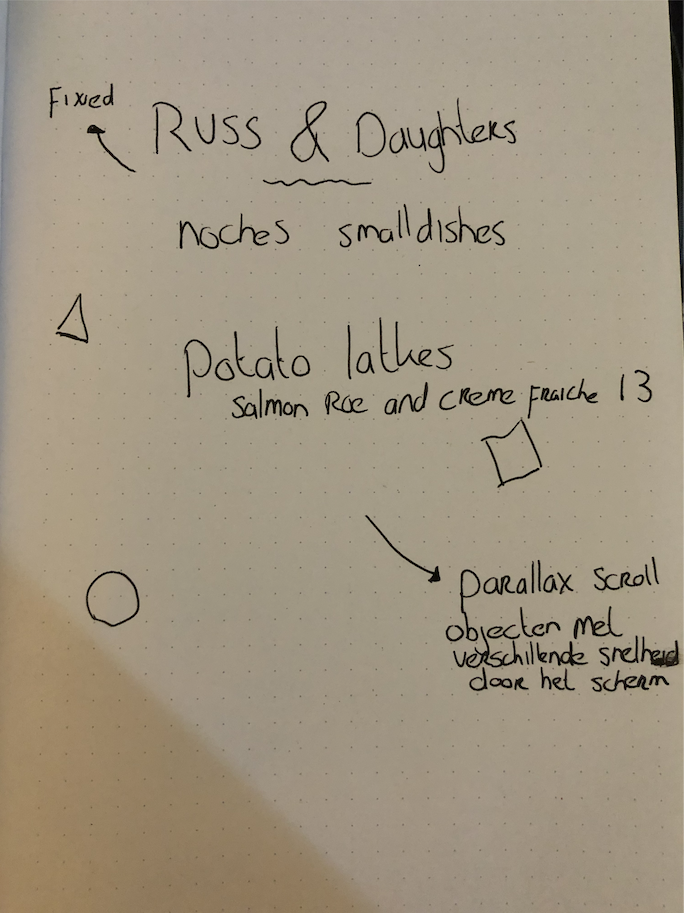

# CSS to the Rescue

# Context
- Prefers-color-scheme: De app zal in dark mode of light mode te zien zijn aan de hand van de color scheme in de OS.

# parallax scroll
Voor deze opdracht wil ik een parallax scroll gebruiken om wat beweging en diepte toe te voegen aan het menu.
Het idee is om de menuitems sneller te laten scrollen dan de achtergrond en ook een aantal svg items met andere snelheden te laten scrollen. de svg's worden de ingredienten van het gerecht.

# Week 1
In de eerste week ben ik vooral bezig geweest met zoeken naar interessante css technieken en het vastleggen van de context en eisen. Ik heb ook een snelle schets gemaakt. 


Verder is er een klein beetje css geschreven om dingen te positioneren en voor wat kleur.

# week 2 
Meer opmaak gedaan voor het menu en de gerechten. Het parallax effect werkende krijgen was niet makkelijk maar werkt voor de gerechten. De svg's (ingredienten) moeten nog worden gedaan. Hieronder kan je zien hoe de parallax er nu uitziet:


# week 3
Parallax effect wat getweaked en toegevoegd op de svg's (ingredienten). Verder heb ik geprobeerd wat leuks te doen met de titel en heb ik de eerste stappen voor de prefers-color-scheme gemaakt.

Hier het resultaat van de titel


Hier het resultaat van de scroll en een nieuwe animatie voor de subtitels (WIP)


# main features & code
## De titel animatie
De titel wilde ik graag animeren en ik heb gekozen voor een stroke animatie. Met 1 stroke per letter zag de animatie er raar uit dus heb ik ervoor gekozen om de stroke op te delen in 5 stukken.


### De code:
HTML:
```
<svg viewBox="">
				<symbol id="rest-title">
					<text text-anchor="middle" x="50%" y="70%">Russ & Daughters</text>
				</symbol>
			
				<g class = "title-copies">
					<use xlink:href="#rest-title" class="text-copy"></use>
					<use xlink:href="#rest-title" class="text-copy"></use>
					<use xlink:href="#rest-title" class="text-copy"></use>
					<use xlink:href="#rest-title" class="text-copy"></use>
					<use xlink:href="#rest-title" class="text-copy"></use>
				</g>
			</svg>
```

Ik maak een svg aan zodat ik de stroke kan animeren. Met de use tag maak ik meerdere kopieen van de titel, deze ga ik later met een delay achter elkaar aan animeren.

CSS:
```
.text-copy {
  fill: none;
  stroke: #fff;
  stroke-dasharray: 6% 29%;
  stroke-width: 5px;
  stroke-dashoffset: 0%;
  animation: stroke-offset 5.5s infinite linear;
}

.text-copy:nth-child(1){
	stroke: var(--accent);
	animation-delay: -1;
}

.text-copy:nth-child(2){
	stroke: var(--secondary);
	animation-delay: -2s;
}

.text-copy:nth-child(3){
	stroke: var(--accentalt);
	animation-delay: -3s;
}

.text-copy:nth-child(4){
	stroke: var(--accentalt);
	animation-delay: -4s;
}

.text-copy:nth-child(5){
	stroke: var(--colorstrong);
	animation-delay: -5s;
}

@keyframes stroke-offset{
	100% {stroke-dashoffset: -35%;}
}
```

De copy's worden aangeroepen door de :nth-child() en ze hebben allemaal een eigen kleur en animatie delay. de min zorgt ervoor dat de animatie al onderweg is. 

## subtitel animatie
